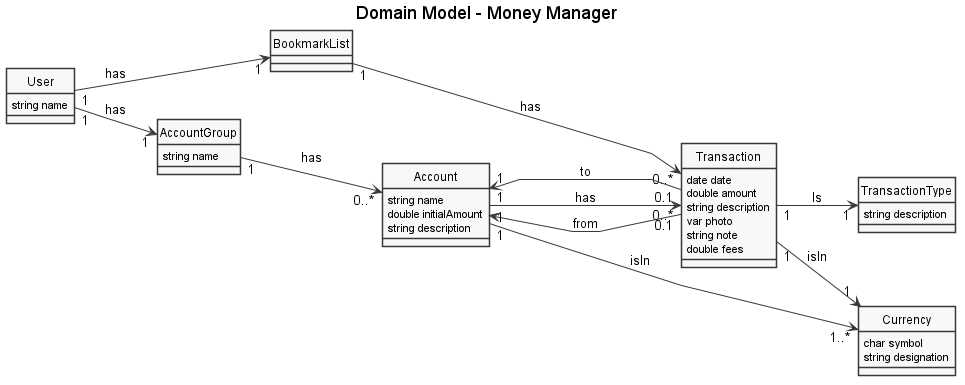

# EDOM Project, Part 1 - Team Report

In this folder you should add **all** artifacts developed for part 1 of the EDOM project, related to team/group work.

**Note:** If for some reason you need to bypass these guidelines please ask for directions with your teacher and **always** state the exceptions in your commits and issues in bitbucket.

Following there are examples of proposed sections for this part of the report (team part).

## Domain Knowledge Obtained from Analyzing the Applications

In this step of the process, each team member analyzed a specific application used for Personal Expenses Management.
Those apps were:
- Money Manager (Android App)
- Money Manager (iOS App)
- Money Board (Android App)

After analysis, we come up with these domain models:

### Money Manager (Android)

### Money Manager (iOS)

### Money Board

## Design of the Metamodel

In this metamodel, attributes such as NIF, email, password won't be represented because they are invariants, so there aren't needed to be represented in the metamodel
In the metamodel we only represent what could change from model to model.

## Constraints and Refactorings

* **Model**
    * nameMustBegreaterThan1Char - each model cannot have a blank or null name 

* **UserSpec**
    * mustHaveAttributeWithDifferentNames - a user cannot have fields with the same name 
    * mustHaveNameAttribute - a user must have an attribute called 'name' - check
    * * nameShouldNotContainSpaces - a user cannot contain spaces in its name
    * nameMustStartWithCapitalLetter - a user's name must start with a capital letter

* **AccountSpec**
    * mustHaveAttributeWithDifferentNames - an account cannot have fields with the same name
    * mustHaveCurrencyAttribute - an account must have an attribute called 'currency' - check
    * nameShouldNotContainSpaces - an account cannot contain spaces in its name
    * nameMustStartWithCapitalLetter - an account's name must start with a capital letter

* **TransactionSpec**
    * mustHaveAttributeWithDifferentNames - a transaction cannot have fields with the same name 
    * mustHaveCurrencyAttribute - a transaction must have an attribute called 'currency' - check
    * mustHaveAmountAttribute - a transaction must have an attribute called 'amount' - check
    * mustHaveDateAttribute - a transaction must have an attribute called 'date' - check
    * nameShouldNotContainSpaces - a transaction cannot contain spaces in its name
    * nameMustStartWithCapitalLetter - a transaction's name must start with a capital letter

* **Association**
    * nameMustBegreaterThan1Char - an association cannot have a blank or null name
    * nameShouldNotContainSpaces - an association cannot contain spaces in its name
    * nameMustStartWithCapitalLetter - an association's name must start with a capital letter

* **UserAttribute**
    * nameMustBegreaterThan1Char - a user cannot have a blank or null name
    
    
* **AccountAttribute**
    * nameMustBegreaterThan1Char - an account cannot have a blank or null name

* **TransactionAttribute**
    * nameMustBegreaterThan1Char - a transaction cannot have a blank or null name

* **AttributeType**

## Metamodel Graphical Representation

For each metamodel element, the team chose a different color to represent:

* TransactionSpec - for the TransactionSpec, we will be using the color Light Blue (**#00e5e5**)
* Association - for the Association, we will be using the color Grey (**#C0C0C0**)
* UserSpec - for the UserSpec, we will be using the PlantUML default color
* AccountSpec - for the AccountSpec, we will be using the color Light Green (**#95e500**)

## Presentations of Models (instances)
* **Activity 7: Application Engineering**
