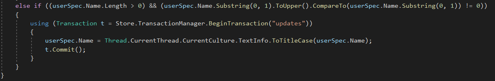

# EDOM Project, Part 1, Tool 2

In this folder you should add **all** artifacts developed for part 1 of the EDOM Project, related to tool 2.

You should also include in this file the report for this part of the project (only for tool 2).

**Note:** If for some reason you need to bypass these guidelines please ask for directions with your teacher and **always** state the exceptions in your commits and issues in bitbucket.

Following there are examples of proposed sections for the report.

## Description of the Tool

Microsoft's Visual Studio Modeling SDK (or MSDK) is a tool that enables the developer to create powerful model-based development tools to integrate with Visual Studio, as well as create one or more model definitions to integrate into a set of tools.

It allows the developer to use tools such as diagrammatic view, code generation abd other artifacts, as well as commands for transforming the model.

## How to Setup and Install

To install Visual Studio's Modeling SDK you have to install Visual Studio. It's a really simple process though.

Start by downloading Visual Studio by accessing this [link](https://visualstudio.microsoft.com/downloads/) and downloading accordingly to your OS.

After running the installation software, a program called Visual Studio installer will execute and from there you can choose which packages to add to Visual Studio to better suit your developing needs. However, to install Modeling SDK, you just have to click "Modify" on the Visual Studio, then access the second tab "Individual Components" and search for "Modeling SDK". Tick that checkbox and then click Install. 

Finally, just launch Visual Studio and start Modeling. (Also pick dark theme)

## Implementation of the Metamodel

To implement the metamodel I clicked the New Project in Visual Studio and then clicked "Domain-specific Language Designer" option which I wrote MoneyManagerModel as the name of the project leading up to a window were I could chose more options too this solution.
I picked the Minimal Language option as it is the reccomended as well as the most versatile one when it comes to writing DSL's.

After that, I created domain classes and relationships following the design we did as a team before resulting in this DSL

To create domain classes and be able to create them in instances, I had to, for each domain class, add a Shape which contains decorators which will represent where domain properties like the name of the domain class will be seen (TopLeft, Centre, BottomRight, etc.). For the relationships, we used reference and embedded connections.

To create options in the DSL instance to create a subject, or a comment for example, I had to create Element Tools in the DSL Explorer tab by right-clicking MoneyManagerModel > Editor > Toolbox Tabs > MoneyManagerModel and selecting "Add Element Tool" and in the properties of said tools insert which class they represent. The same was done to create the various Connection Tools. The result were these tools that I could use to create my DSL instance.

## Implementation of Constraints and Refactorings

After playing around with DSL instances constraints needed to be added following the team analysis and so all the constraints mentioned before were added, them being:

* **Model**
    * nameMustBegreaterThan1Char - each model cannot have a blank or null name 

* **UserSpec**
    * mustHaveAttributeWithDifferentNames - a user cannot have fields with the same name 
    * mustHaveNameAttribute - a user must have an attribute called 'name' - check
    * * nameShouldNotContainSpaces - a user cannot contain spaces in its name
    * nameMustStartWithCapitalLetter - a user's name must start with a capital letter

* **AccountSpec**
    * mustHaveAttributeWithDifferentNames - an account cannot have fields with the same name
    * mustHaveCurrencyAttribute - an account must have an attribute called 'currency' - check
    * nameShouldNotContainSpaces - an account cannot contain spaces in its name
    * nameMustStartWithCapitalLetter - an account's name must start with a capital letter

* **TransactionSpec**
    * mustHaveAttributeWithDifferentNames - a transaction cannot have fields with the same name 
    * mustHaveCurrencyAttribute - a transaction must have an attribute called 'currency' - check
    * mustHaveAmountAttribute - a transaction must have an attribute called 'amount' - check
    * mustHaveDateAttribute - a transaction must have an attribute called 'date' - check
    * nameShouldNotContainSpaces - a transaction cannot contain spaces in its name
    * nameMustStartWithCapitalLetter - a transaction's name must start with a capital letter

* **Association**
    * nameMustBegreaterThan1Char - an association cannot have a blank or null name
    * nameShouldNotContainSpaces - an association cannot contain spaces in its name
    * nameMustStartWithCapitalLetter - an association's name must start with a capital letter

* **UserAttribute**
    * nameMustBegreaterThan1Char - a user cannot have a blank or null name
    
* **AccountAttribute**
    * nameMustBegreaterThan1Char - an account cannot have a blank or null name

* **TransactionAttribute**
    * nameMustBegreaterThan1Char - a transaction cannot have a blank or null name

* **AttributeType**

In Visual Studio Constraints are represented by Validations, and before writing some I had to enable them like so:

After enabling Validations all I had to do was create a partial class of the domain class I wanted to put the validation, for example for Model validations I created a Constraints.cs with a partial class like this:

All annotations such as `[ValidationState(ValidationState.Enabled)]` above the class and `[ValidationMethod(ValidationCategories.Save | ValidationCategories.Menu | ValidationCategories.Open)]` before each method are necessary for when a user validates its instance the ValidationController passes through these validations. I used 3 Validation Categorioes: Save, Menu and Open, which means that these validations will run when the DSL instance is Saved, validated through the Menu option as well as when it is Opened.

One disadvantage of this easy validation method is not being able to put these validation files/partial classes somewhere more organized as they need to be at the same level as the DslDefinition.dsl file.

We refactor the names that aren't in capital letter. One example is:

## Implementation of the Visualizations

The requirement for the model visualization was the code should be able to generate a diagram in the PlantUML program. In order to have a full implementation of the PlantUML I created a class called Program.cs and it will create a .puml class called Test. 

In the next image we can see the result:

User - PlantUML Default
AccountSpec - Light Green
Association - Grey
TransactionSpec - Light Blue

## Implementation of Models (instances)

For this topic I created an instance of my DSL according to my MoneyManagerModel, respecting all constraints, like so:

## Execution of Constraints and Refactorings

When executing the constraints implemented below it is possible to see they are woking:

## Generation/Execution of Visualizations

The execution of visualizations could be performed using the Transform All Templates tool used to generate the metamodel but in the "Running" mode. Being that the used format for text generation is the one provided by Visual Studio (T4 Text Generation), the Transform All Templates could integrate the created template and generate it accordingly. 

