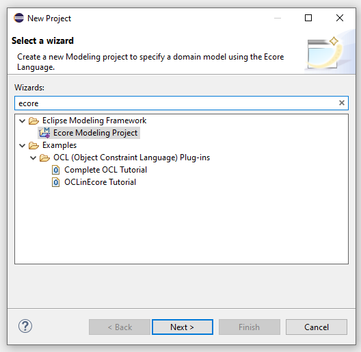
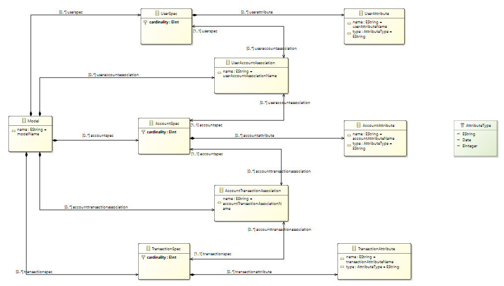
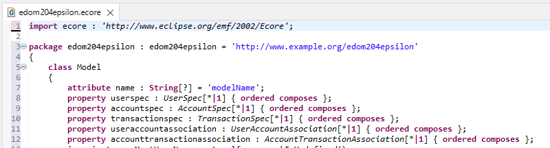
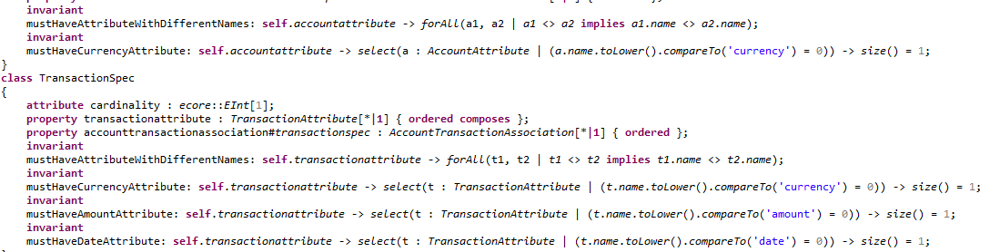
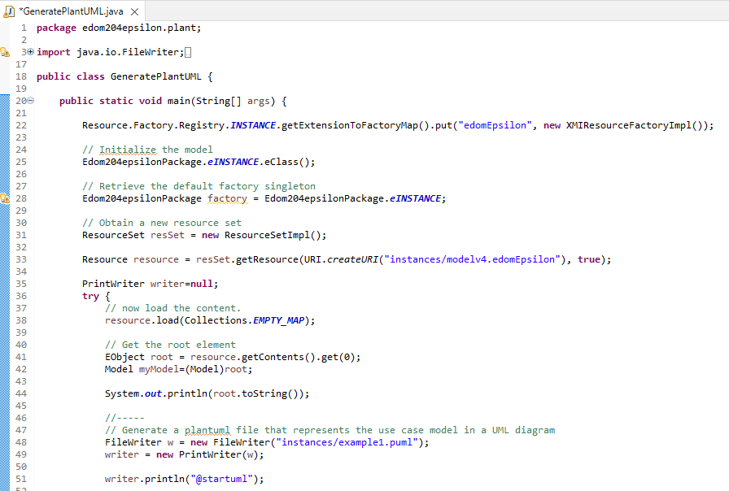
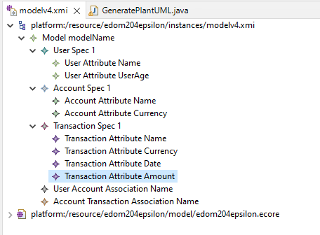
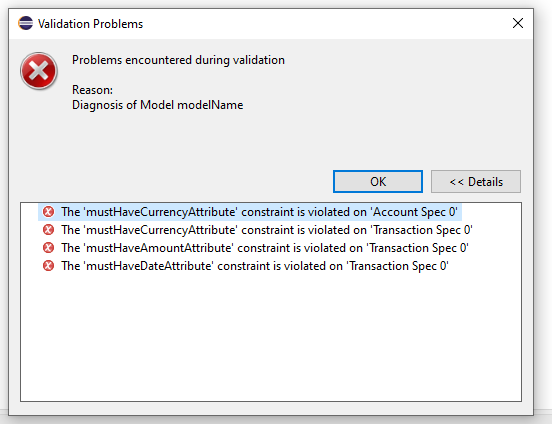
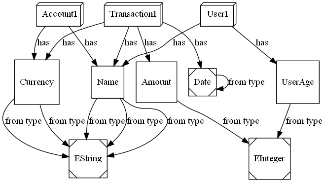

# EDOM Project, Part 1, Tool 3

In this folder you should add **all** artifacts developed for part 1 of the EDOM Project, related to tool 3.

You should also include in this file the report for this part of the project (only for tool 3).

**Note:** If for some reason you need to bypass these guidelines please ask for directions with your teacher and **always** state the exceptions in your commits and issues in bitbucket.

Following there are examples of proposed sections for the report.

## Description of the Tool

Epsilon is a family of Java-based scripting languages for automating common model-based software engineering tasks, such as code generation, model-to-model transformation and model validation, that work out of the box with EMF (including Xtext and Sirius), UML, Simulink, XML and other types of models.  
Epsilon also includes Eclipse-based editors and debuggers, convenient reflective tools for textual modelling and model visualisation, and Apache Ant tasks.

All languages are built on top of a common language for model querying and modification called Epsilon Object Language.

## How to Setup and Install

Download the [Eclipse Installer](https://wiki.eclipse.org/Eclipse_Installer) and select Epsilon. Note that you will need a Java Runtime Environment installed on your system.

## Implementation of the Metamodel

Before implementing the metamodel using Epsilon, we need to create an **Ecore Modelling Project**:



Then we edit the ecore file to design the metamodel using the graphical view in Epsilon:



Epsilon automatically processes the file and keeps updating the project.ecore file. Which we will use to add Constraints.

## Implementation of Constraints and Refactorings

After the metamodel design is finished we started by adding constraints.
As previously stated in the global report some of the restraints are:

- Names cannot be null
- First letter must be upper case

```java
invariant mustHaveName: not self.name.oclIsUndefined();
invariant nameMustStartWithUppercase: self.name.substring(1,1).toUpper().compareTo(self.name.substring(1, 1)) = 0;
```



In this Editor, we can change some of the attributes and properties of our metamodel elements as shown in the image above.



## Implementation of the Visualizations

To create a model visualization, there is a class called GeneratePlantUML (identical to the class use in the EDOM classes) that will generate a plantuml using the model as a base.




## Implementation of Models (instances)



## Execution of Constraints and Refactorings

When executing the constraints implemented below it is possible to see they are woking:



## Generation/Execution of Visualizations

