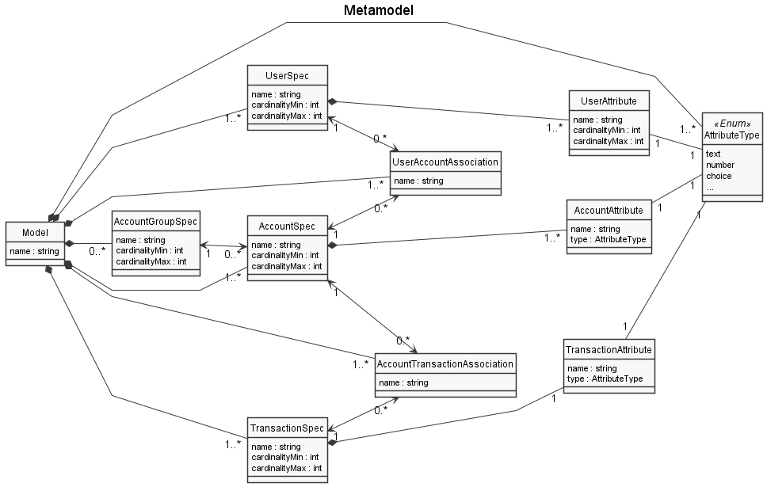

# EDOM Project, Part 2 - Team Report

In this folder you should add **all** artifacts developed for part 2 of the EDOM project, related to team/group work.

**Note:** If for some reason you need to bypass these guidelines please ask for directions with your teacher and **always** state the exceptions in your commits and issues in bitbucket.

Following there are examples of proposed sections for this part of the report (team part).

## Domain Knowledge Obtained from Analyzing the Applications

## Design of the Metamodel

### Changes of Part 1 Model

## Activity 1: Design Concrete Syntax for the DSL

### Graphical DSL 

#### Epsilon/Eugenia

#### MS Tools

#### Textual DSL (JetBrains MPS)

## Activity 2: Specify Common Features for Applications of the Domain

## Activity 3: Implement Prototypes of Applications of the Domain

- **[MoneyManager iOS Prototype](tool1-mps/readme.md)**

- **[MoneyBoard Prototype](tool2-ms/readme.md)**

- **[MoneyManager Android Prototype](tool3-epsilon/readme.md)**

## Activity 4: Identify Commonality and Variability in the Code

## Activity 5: Design and Implement Code Generation

- **[MoneyManager iOS Prototype](tool1-mps/readme.md)**

- **[MoneyBoard Prototype](tool2-ms/readme.md)**

- **[MoneyManager Android Prototype](tool3-epsilon/readme.md)**

## Activity 6: Generate Applications

## Constraints and Refactorings

## Metamodel Graphical Representation

## Presentations of Models (instances)
