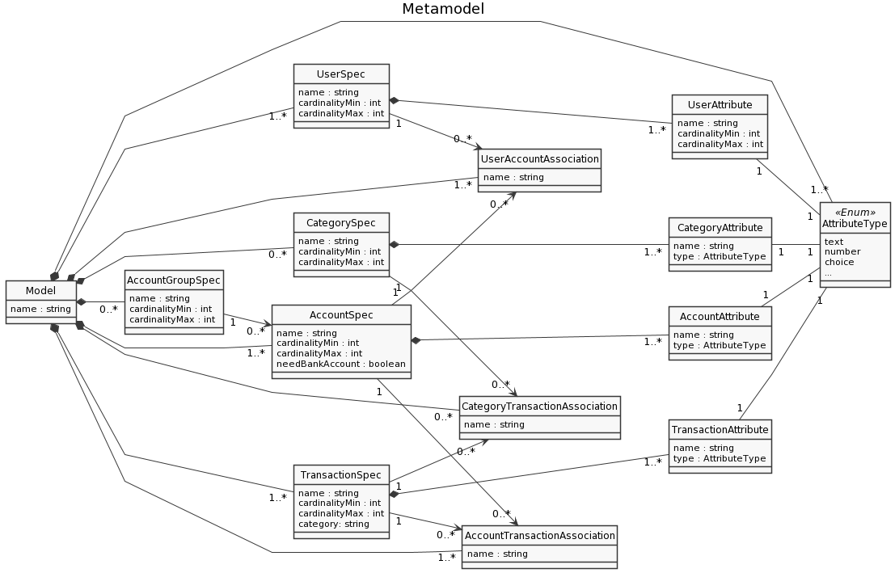

# EDOM Project, Part 2 - Team Report

In this folder you should add **all** artifacts developed for part 2 of the EDOM project, related to team/group work.

**Note:** If for some reason you need to bypass these guidelines please ask for directions with your teacher and **always** state the exceptions in your commits and issues in bitbucket.

Following there are examples of proposed sections for this part of the report (team part).

## Domain Knowledge Obtained from Analyzing the Applications

## Design of the Metamodel

### Changes of Part 1 Model

As we can see in the image above, we added a new component called CategorySpec as well as CategoryAttribute. This new component represents the Transaction's Category, in other words, that transaction intent like (Food, Bills, Hobby, ...)

## Activity 1: Design Concrete Syntax for the DSL

### Graphical DSL (Epsilon/Eugenia)
For each metamodel element, the team chose a different graphically representation:

* AccountGroupSpec - for the AccountGroupSpec, we will be using an **blue square** object;
* UserSpec - for the UserSpec, we will be using an **oval yellow** object;
* AccountSpec - for the AccountSpec, we will be using an **oval red** object;
* TransactionSpec - for the TransactionSpec, we will be using a **oval green** object;
* UserAccountAssociation - for the UserAccountAssociation, we will be using a **orange** link;
* AccountTransactionAssociation - for the AccountTransactionAssociation, we will be using a **purple** link;
* UserAttribute - for the UserAttribute, we will be using a **yellow square** object;
* AccountAttribute - for the AccountAttribute, we will be using a **red square** object;
* TransactionAttribute - for the TransactionAttribute, we will be using a **green square** object;
* AttributeType - for the AttributeType, we will be using a **oval blue** object;

### Graphical DSL (MS Tools)
For each metamodel element, the team chose a different graphically representation:

* AccountGroupSpec - for the AccountGroupSpec, we will be using an **rectangle red ** object;
* UserSpec - for the UserSpec, we will be using an **orange rectangle** object;
* AccountSpec - for the AccountSpec, we will be using an **red rectangle** object;
* TransactionSpec - for the TransactionSpec, we will be using a **gold rectangle** object;
* CategorySpec - for the CategorySpec, we will be using a **purple rectangle** object;
* UserAccountAssociation - for the UserAccountAssociation, we will be using a **white rectangle** link;
* AccountTransactionAssociation - for the AccountTransactionAssociation, we will be using a **white rectangle** link;
* CategoryTransactionAssociation - for the CategoryTransactionAssociation , we will be using a **white rectangle** link;
* UserAttribute - for the UserAttribute, we will be using a **orange curve rectangle** object;
* AccountAttribute - for the AccountAttribute, we will be using a **red curve rectangle** object;
* TransactionAttribute - for the TransactionAttribute, we will be using a **gold curve rectangle** object;
* CategoryAttribute - for the CategoryAttribute, we will be using a **purple curve rectangle** object;
* AttributeType - for the AttributeType, we will be using a **blue curve rectangle** object;

### Textual DSL (JetBrains MPS)

For each metamodel element, the team chose a different graphically representation:

* For UserSpec, AccountSpec, TransactioSpec, AccountGroupSpec and CategorySpec the class name will be in **bold**.
* For UserAttributes, AccountAttributes, AccountAttributes the class name will be in **bold** and *italic*.

## Activity 2: Specify Common Features for Applications of the Domain

For the prototypes we will be using a common OO Language such as Java or C# and we will be developing a console application based in the MoneyManager(iOS), Moneyboard and MoneyManager(Android) apps.
The team choose Java as object oriented programming languages by each member preference and to show the possibilities of code generation techniques that will be used on the activities ahead.

For all models, there are some common functionalities:

- Create User
    - The User need to create a User based on UserSpec that will contain Attributes/fields based on UserAttribute and a name. 
    - In this case we will assume a User has an Account list for simplicity.
- Create Account
    - The User need to create an Account based on AccountSpec that will contain Attributes/fields based on AccountAttribute and a name. 
    - In this case we will assume a Account has a Transaction list for simplicity.
- Make Transaction
    - The User need to create Transaction based on TransactionSpec that will contain Attributes/fields based on TransactionAttribute and a name.
    - In this case we will assume a Transaction has one Category for simplicity. Category could be "Income" or "Expense".
- Create AccountGroup
    - The User need to create an AccountGroup based on AccountGroupSpec that will contain Attributes/fields based on AccountAttribute and a name. 
    - In this case we will assume a AccountGroup has a Account list for simplicity.

- Add Accounts to Accounts Groups
    - The user can add an existing account to an existing account group.
- Show the User Profile
    - The User wants to see his profile.
- List Accounts
    - The User wants to get all the accounts that he had created.
- List AccountGroups
    - The User wants to get all the accounts groups that he had created.
- List Transactions
    - The User wants to get all the transactions that he had made.

## Activity 3: Implement Prototypes of Applications of the Domain

- **[MoneyManager iOS Prototype](tool1-mps/readme.md)**

- **[MoneyBoard Prototype](tool2-ms/readme.md)**

- **[MoneyManager Android Prototype](tool3-epsilon/readme.md)**

## Activity 4: Identify Commonality and Variability in the Code

### Commonalities

After analysing all the prototypes developed, we realised that there were some common classes and functionalities that could be generated in the next activity:

* Model - this would be a class that could/should be implemented for each specific model. This can give us some default/common methods and variables for all the implementations;
* User - same as Model. This class is a constant that is present in all the studied applications and therefore shall have a presence on the generated code.
* Account - same as User.
* Transaction - same as Account and User.
* User/Account/Transaction Attributes - Those are part of above models and are mandatory per model validations.

### Variabilities

As opposed to commonalities, there are some aspects of the metamodel that may or may not have a presence when building a model. Those classes/funcionalities are:

* AccountGroupSpec - AccountGroupSpec is an aspect that is present in some studied applications but not all of them. Some applications don't have the concept of an 'Account library' therefore in those models, this Spec is not instanciated/not exists.
* CategorySpec - Same as AccountGroupSpec. Not every application has the concept of Category or something that describes the Transaction main intent or 'area'.
* CategoryAttributeSpec - Since this concept is directly related to category, it follows the same fate as the above.
* needBankAccount - Some applications don't ask for the bank account to create an account.

## Activity 5: Design and Implement Code Generation

Class attributes and constructors - Each Class derived from UserSpec, AccountSpec, TransactionSpec and CategorySpec, has attributes (at least one since it's a model validation parameter).  
Those attributes when 'translated' into a Object Oriented Application have the same syntax, placement and instanciation.  
Therefore it's the main concern that the team shall address in the following activities.

- **[MoneyManager iOS Prototype](tool1-mps/readme.md)**

- **[MoneyBoard Prototype](tool2-ms/readme.md)**

- **[MoneyManager Android Prototype](tool3-epsilon/readme.md)**

## Activity 6: Generate Applications

After generating all the code in the different applications, the generation was tested for the 3 existing models and the necessary code was generated without any problem. This allowed us to understand all the possibilities that this type of Low Code Technologies provide, allowing to generate 3 different applications but with common points, using the same files.

## Constraints and Refactorings

**Model**
* nameMustBegreaterThan1Char - each model cannot have a blank or null name
* mustNotHaveDuplicatedAssociations - each association contained in the model shall have diferent references from one another

**UserSpec**
* mustHaveAttributeWithDifferentNames - a user cannot have fields with the same name 
* mustHaveNameAttribute - a user must have an attribute called 'name' - check
* nameShouldNotContainSpaces - a user cannot contain spaces in its name
* nameMustStartWithCapitalLetter - a user's name must start with a capital letter
* cardinalityMaxMustBeHigherThanCardinalityMin - a user's max cardinality ma must be higher than min cardinality

**AccountSpec**
* mustHaveAttributeWithDifferentNames - an account cannot have fields with the same name
* mustHaveCurrencyAttribute - an account must have an attribute called 'currency' - check
* nameShouldNotContainSpaces - an account cannot contain spaces in its name
* nameMustStartWithCapitalLetter - an account's name must start with a capital letter
* cardinalityMaxMustBeHigherThanCardinalityMin - a Account's max cardinality ma must be higher than min cardinality

**TransactionSpec**
* mustHaveAttributeWithDifferentNames - a transaction cannot have fields with the same name 
* mustHaveCurrencyAttribute - a transaction must have an attribute called 'currency' - check
* mustHaveAmountAttribute - a transaction must have an attribute called 'amount' - check
* mustHaveDateAttribute - a transaction must have an attribute called 'date' - check
* nameShouldNotContainSpaces - a transaction cannot contain spaces in its name
* nameMustStartWithCapitalLetter - a transaction's name must start with a capital letter
* cardinalityMaxMustBeHigherThanCardinalityMin - a transaction's max cardinality ma must be higher than min cardinality

**CategorySpec**
* mustHaveAttributeWithDifferentNames - a Category cannot have fields with the same name 
* mustHaveCurrencyAttribute - a Category must have an attribute called 'currency' - check
* mustHaveAmountAttribute - a Category must have an attribute called 'amount' - check
* mustHaveDateAttribute - a Category must have an attribute called 'date' - check
* nameShouldNotContainSpaces - a Category cannot contain spaces in its name
* nameMustStartWithCapitalLetter - a Category's name must start with a capital letter
* cardinalityMaxMustBeHigherThanCardinalityMin - a category' max cardinality ma must be higher than min cardinality

**UserAccountAssociation**
* nameMustBegreaterThan1Char - an User Account Association cannot have a blank or null name
* nameShouldNotContainSpaces - an User Account Association cannot contain spaces in its name
* nameMustStartWithCapitalLetter - an User Account Association name must start with a capital letter

**AccountTransactionAssociation**
* nameMustBegreaterThan1Char - an Account Transaction Association cannot have a blank or null name
* nameShouldNotContainSpaces - an Account Transaction Association  cannot contain spaces in its name
* nameMustStartWithCapitalLetter - an Account Transaction Association  name must start with a capital letter

**CategoryTransactionAssociation**
* nameMustBegreaterThan1Char - a Category Transaction Association cannot have a blank or null name
* nameShouldNotContainSpaces - a Category Transaction Association cannot contain spaces in its name
* nameMustStartWithCapitalLetter - a Category Transaction Association name must start with a capital letter

**UserAttribute**
* nameMustBegreaterThan1Char - a user cannot have a blank or null name

**AccountAttribute**
* nameMustBegreaterThan1Char - an account cannot have a blank or null name

**TransactionAttribute**
* nameMustBegreaterThan1Char - a transaction cannot have a blank or null name

**CategoryAttribute**
* nameMustBegreaterThan1Char - a category cannot have a blank or null name

**AttributeType**

## Presentations of Models (instances)

### MPS

### MS Tools

