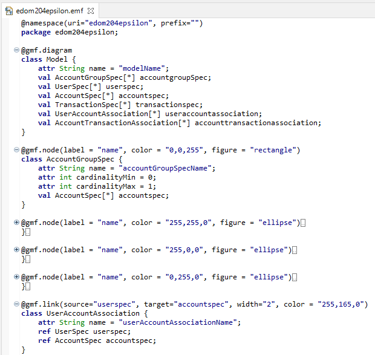
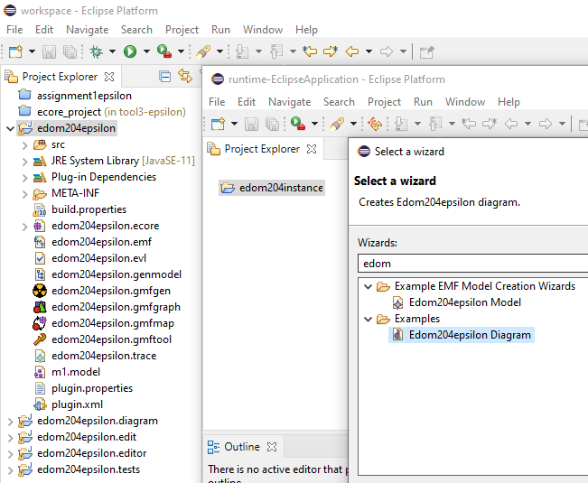
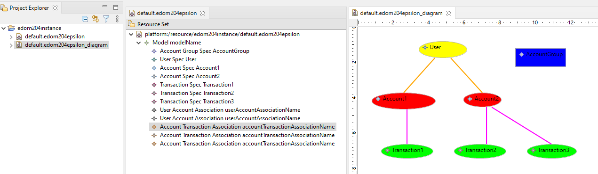
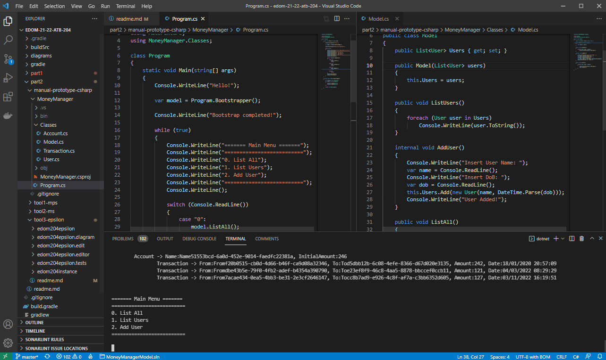
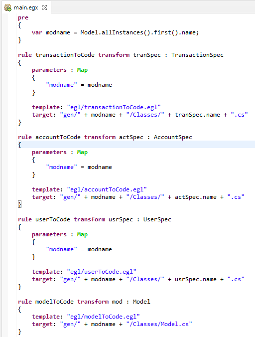
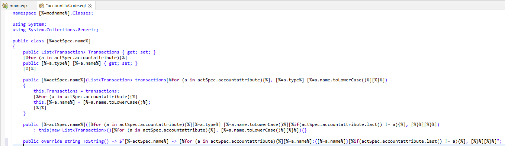
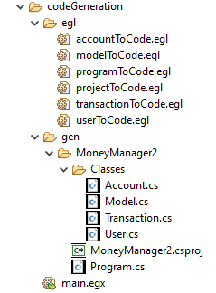

# EDOM Project, Part 2, Tool 3

## Description of the Tool

Epsilon (Extensible Platform of Integrated Languages for Model Management) is a platform for builing consistent and interoperable task-specific languages for model management tasks such:
    - Model Validation
    - Model to model transformation
    - Model to text transformation
    - Model migration
    - Pattern matching

All languages are built on top of a common language for model querying and modification called Epsilon Object Language.

For this part of the project, there were some tools used with the Epsilon: the Eugenia to generate the DSL and the EGL (Epsilon Generation Language) for the code generation.

## Activity 1: Design Concrete Syntax for the DSL

As said before, to design the DSL, we used Eugenia that is a tool that simplifies the development of GMF-based graphical model editors by automatically generating the **.gmfgraph**, **.gmftool** and **.gmfmap** models needed by GMF editor from a single annotated Ecore metamodel or EMF file (that can be used to generate an Ecore Metamodel).

In this project, we applied the Eugenia annotations to the previous developed Ecore metamodel, adding the following annotations:

* **gmf.diagram** - Denotes the root object of the metamodel. Only one (non-abstract) Class must be annotated as gmf.diagram. In this case, we annotated **Model** Class
* **gmf.node** - Applied to an Class and denotes that it should appear on the diagram as a node. Some details were applied to this annotation:
    * **label = 'name'** - the name(s) of the Attribute(s) of the Class, the value(s) of which will be displayed as the label of the node. In this case, we used **name** for every node.
    * **color = '0,0,0'** -  an RGB color that will be set as the node's background color (e.g. 255,0,0).
    * **figure = '...'** -  the figure that will represent the node. Can be set to rectangle, ellipse, rounded (default), svg, polygon or the fully qualified name of a Java class that implements Figure.

After the annotations are applied, we run the Eugenia option "Generate GMF Editor" and obtain the files .genmodel, .gmfgen, .gmfgraph, .gmfgraph, .gmfgraph, .gmftool and all the metamodel classes in the src package.

We can test the DSL, running the program in a new instance and creating a new project and a **.edom204epsilon** file as well as creating a Model based in the metamodel before.

## Activity 3: Implement Prototypes of Applications of the Domain

To plan the classes that would have to be generated by our project, a prototype was initially created in C# with a console application that intended to create, list and edit the model at work (in this case, the MoneyManager (Android) model).

All domain classes were created together with all the necessary methods for creating and handling objects in the application.

## Activity 5: Design and Implement Code Generation

To implement code generation with Epsilon, we need to use some new files: **.egl** and **.egx**.

The EGL Co-Ordination Language (EGX), as the name implies, it is a coordination and automation language for executing EGL files.

In the image below, it is represented a small part of the EGX file used that contains several rules that uses some templates that will generate the C# classes we designed in the EMF Model for the application(s).

The EGL is a language tailored for model-to-text transformation (M2T), template-based and that provides several features to simplify the design of the templates needed. EGL can be used to transform models into various types of textual artefact, including code (e.g. Java, C#...), reports (e.g. in HTML/LaTeX), images (e.g. using Graphviz), formal specifications (e.g. Z notation), or even entire applications comprising code in multiple languages (e.g. HTML, Javascript and CSS).

In the example below, we can see the base structure of a C# class that will be instanciated with the info of the EMF Model.

EGL is similar in purpose to server-side scripting languages like PHP and a EGL template is a text file which has both static and dynamic regions. As the name implies, a static region is where text appears as-is in the output, whereas a dynamic region uses code to generate the output, often relying on data which is only available at runtime.  
Dynamic regions are expressed using EOL with this notation "[%" and "%]".

To run the EGX model in Eclipse, we just need to create an "EGL Generator" Running Configuration with the **main.egx** file specified and the model we want to use (we need to specify the **Model.xmi** or **Model.model** created along with the **.emf**/**.ecore** metamodel). 

Using this, all the C# code was generated, including all model objects, methods and main class, creating a functional console application for the 3 Models presented (MoneyManager(Android), MoneyManager(iOS) and MoneyBoard).

## Activity 6: Generate Applications

Using the EGL templates, we were able to generate code for all the Models, using the Generic/Common classes between them.

The implementation was based in abstract classes and interfaces, which made possible the reuse of code between models and the use of models with pieces of dynamic code also allowed us to pass the necessary parameters to generate the intended models.

